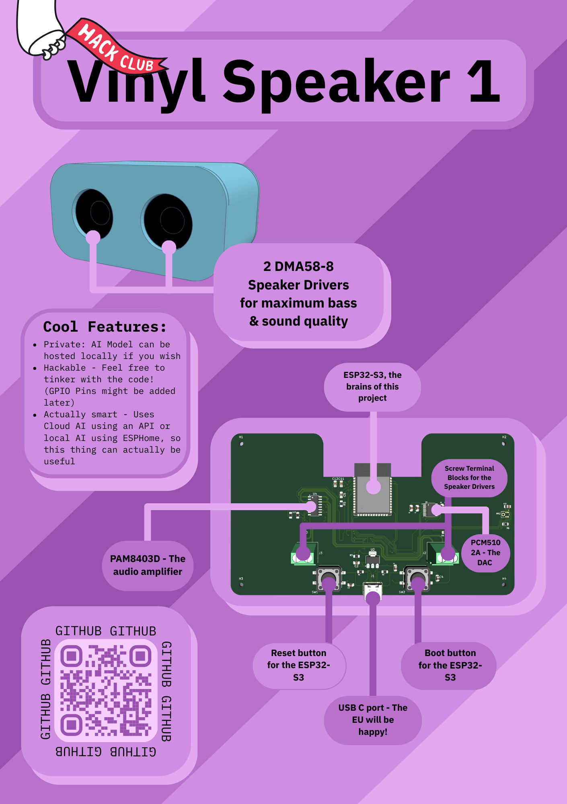

<h1>VSPKR1</h1>

[Tinkercad URL (STL)](https://www.tinkercad.com/things/8K3mWJbN8PP-vinyl-speaker-1-case)
### What is it?

The VSPKR1 (Vinyl Speaker 1) is an open source alternative to Alexa, Google Home, or a Homepod, but open source (similar to the Home Assistant Voice Preview edition, but also made for music and not only Assist!)  
It can / will be able to be used with either cloud AI or local Ollama AI (or alternatives), making it maybe smarter than your existing smart speakers!

### Why did I decide to make this?
There are 2 reasons that I decided to make this; First, I wanted to for HackClub! Second, privacy. I have heard that Google Home speakers can spy on you, and listen in to your conversations. I think that is true 100%, so that's why I made this! To De-Google!

### A quick overview on how to build this;

> [!NOTE]
> I unfortunately got a hairline fracture on my arm while working on this project.  
> Sorry if this guide is bad in any way! 
> Also, this guide assumes you have either a hot plate or a hot air rework station

Step 1. Getting the parts 
All of the parts (except the PCB) are in the BOM.csv file with Digikey Part ID's for each part and quantities. 
Order those to get started! 
Make sure to also get the case 3D printed from somewhere (PCBWay can make the PCB + 3D Printed case!)
  
Step 2. Ordering PCB 
For this, open the `pcb` folder in the root of this repo as a project in KiCad. Then, you can export the gerber files from the `File` menu. 
From there, you can then order that PCB from your preferred PCB manufacturer.
  
Step 3. Build it! 
Once all the parts and PCB have arrived, you can then use a hot plate or hot air rework station, assuming you have one to solder all the parts to the PCB. For easier soldering, take a look at the PCB viewer in KiCad on a monitor while soldering.
  
Step 4. Flash ESPHome 
Follow the guide at `esphome.io` to flash the board with ESPHome firmware
  
Step 5. VSPKR1 Firmware 
Connect the PCB to your computer and drag and drop the `ESPHome.yaml` file from the `firmware` folder to the PCB, when it shows up as a USB Drive. You are done! Enjoy your speaker!

### Screnshots:
 

